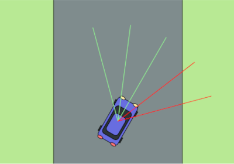

# Self driving car

A javascript simulation in which cars learn to navigate themselves through a track. The cars are controlled by a feedforward Neural Network. The weights of the network are trained using a genetic algorithm.

## The Simulation

Cars have to navigate through a course without going outside the track. A car has five sensors covering a front facing range of 90 degrees to measure the distance to obstacles in a given direction. The readings of these sensors serve as the input of the car's neural network. The output of the Neural Network then determines the car’s current acceleration and steering force.

## The Neural Network

The Neural Network used is a standard, fully connected, feedforward Neural Network. It comprises 3 layers: an input layer with 7 neurons, a hidden layer with 10 neurons and an output layer with 2 neurons.

## Training the Neural Network

The weights of the Neural Network are trained using an Evolutionary Algorithm known as the Genetic Algorithm.

At first there are N randomly initialised cars spawned. Cars are then selected to be recombined with each other, creating new "offspring" cars. These offspring cars then form a new population of N cars and are 
also slightly mutated in order to inject some more diversity into the population. The newly created population of cars then tries to navigate the course again and the process of evaluation, selection, crossover and mutation starts again. One complete cycle from the evaluation of one population to the evaluation of the next is called a generation.
